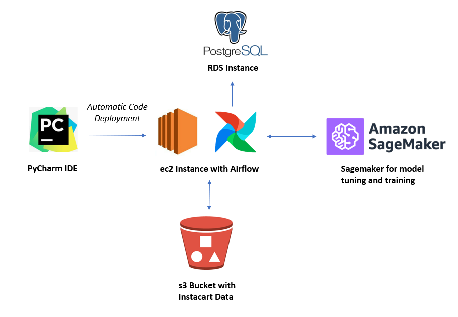
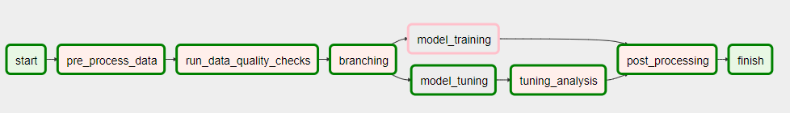
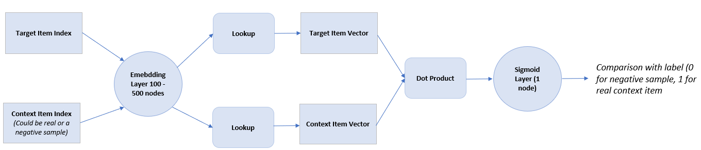
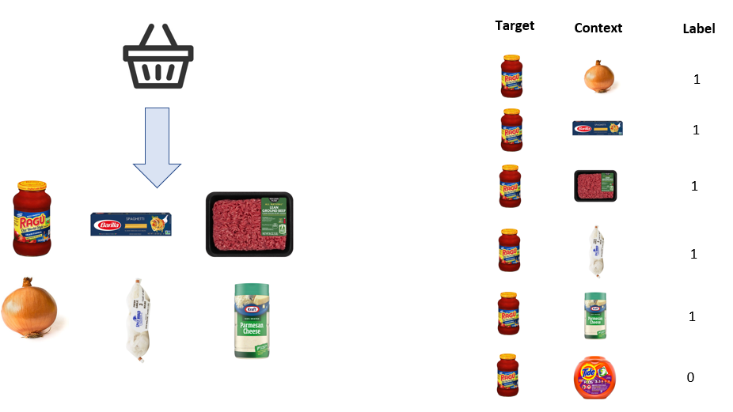
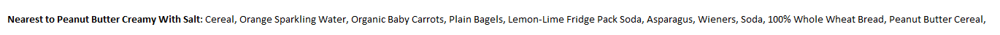
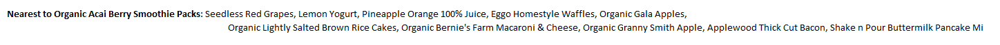

# Modeling pipeline for prod2vec training with Python, Keras, Sagemaker and Airflow

### Project scope

This project contains a pipeline, orchestrated with Airflow, for training product vectors with Amazon Sagemaker.  The output of the pipeline is a set of trained product vectors that can be utilized in further modelling or analysis.

### Data utilized

The data utilizes Instacart data uploaded on to kaggle that contains customer orders and all items contained within the orders along with various mapping tables allowing for product ID's to be mapped to descriptions.  The data can be downloaded from [here](
https://www.kaggle.com/c/instacart-market-basket-analysis/data)

Specifically, the 'orders.csv' and 'products.csv' data sets were used in this project.

### Infrastructure

The infrastructure utilized to train the model is shown in the diagram below:

PyCharm was utilized as the IDE and code was automatically deployed to an ec2 instance with Airflow installed with a Postgres RDS instance.  Data was stored in an s3 bucket, models were tuned and trained utilizing Amazon Sagemaker.

### Airflow Orchestration

As menitoned above, Airflow was utilized to orchestrate and automate the pipeline.  The diagram below shows the DAG and tasks:

**pre_process_data:**  Reads the orders data and pre-processes it into lists of target and context pairs for ingestion into the model (more details in the modelling section below)  
**run_data_quality_checks:** Runs basic data quality checks on the pre-processed data prior to modelling e.g. missing value checks, data integrity checks  
**branching:** Task determines whether to run the hyperparameter tuning - this can be skipped if hyperparameters are known to speed up training  
**model_training:** Trains the model using provided hyperparameters  
**model_tuning:** Tunes the number of embeddings and learning rate with Bayesian hyperparameter tuning techniques  
**tuning_analysis:** Obtains a csv with the best training jobs from the tuning and some plots of the tuning job showing the hyperparameter search  
**post_processing:** Obtains the embedding layer from the model   

### prod2vec model details  

The model is based on a word2vec model developed with Keras explained in the following [blog](https://adventuresinmachinelearning.com/word2vec-keras-tutorial/).  

The model architecture is shown in the illustration below:

The model takes as input a target and context item pair which is passed through an embedding layer.  The size of the embedding layer can be tuned, in the model run in this project it was tuned between 100 and 500 nodes. The dot product between the context and target embeddings is calculated and the resulting vector is passed to a single node sigmoid layer where the target / context paired as classified as being a genuine pair (the item was found within the context) or a negative sample (the item was not found within the context). 

Target and context pairs are identified utilizing the Keras skipgrams method which utilizes negative sampling to identify examples that are not part of the context. 

The diagram below aims to illustrate how skipgram is utilized in the context of this grocery example:    

In the illustration, an order is shown that contains 6 items. The target / context pairs for the pasta sauce are shown in the right hand table where 'true' pairs are labeled as 1 as the item was found within the context of the basket.  The Tide Pods are labeled as 0, for this basket this would be a negative sample as the item was not found within the context of the basket.  

The 'context' for prod2vec in this project is ideally any item that is found within the same basket as a target item.  To speed up the processing the items in the basket are randomly shuffled (since order does not matter in this example) and a 'window' is utilized as the context.  In the run found in this project a window size of 5 was utilized.  This enabled the model to train faster and improved the loss metrics as it enabled the model to be trained on a larger number of baskets.

### Example output

Utilizing the product vectors it is possible to identify the 'most similar' items to a given item.  The example below shows the most similar items to peanut butter:  

  

In this example the most similar items are other staples (e.g. cereal, sparkling water, soda), complimentary items (e.g. whole wheat bread, bagels), other peanut butter flavored items e.g. peanut butter cereal.  

The example below shows the most similar items to sea salt caramel gelato:

  

In this example the most similar items are other caramel or sweet flavored desserts.  

The example below shows the most similar items to acai berry smoothie packs:

  

In this example the most similar items are other breakfast items and juices (e.g. orange juice, pineapple juice, waffles, bacon, pancake mix), items with appeal to children (e.g. mac and cheese), healthy snacks (e.g. rice cakes).  

### Recommended hyperparameters  

To produce this output, the model was trained with embeddings of size 1024 with 300,000 epochs (item / context example pairs) and a learning rate of 0.01.  With these settings the 'similarity' examples were becoming logical (as shown above), the test set loss was significantly slowing although it was still dropping so the model would likely remain slightly underfitted and should be trained for longer.  Increasing the learning rate was causing the loss to increase over epochs.  

The code has been set up to allow for hyperparameter tuning with Bayesian optimization if re-tuning the hyperparameters is desierd.  
